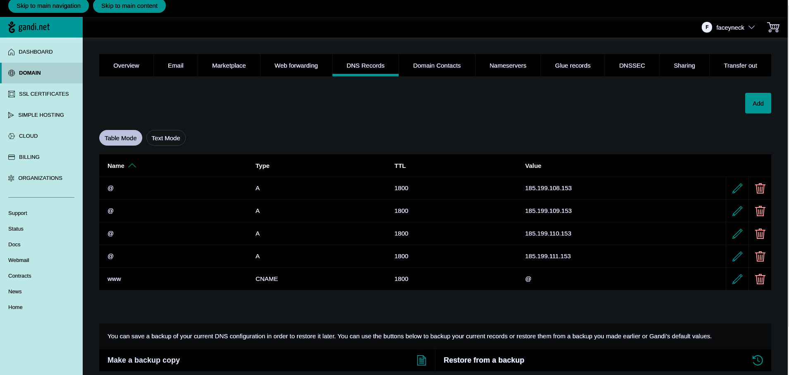

# faceyneck.github.io
GitHub Pages website

This took far more effort than I hoped it would. I have a sneaking suspicion this is simply because web devlopment happens so quickly, it is difficult to stay on top of the needed procedures to get a website working.

### What I started with
I registered my domain name with gandi.net, and trying to get it working with GitHub pages (faceyneck.com) was an impressively difficult task that took me a couple days to figure out.

GitHub's tutorial on how to use GitHub pages was clear and worked without issue. I'm happy about that! 🙂

### Where I wanted to end up
Thankfully, I have a few friends who are at least as much of a computer nerd as I am (probably more-so.) and that proved to be essential. Here's a brief rundown on what I went about doing to get [faceyneck.com](https://faceyneck.com) [https://facenyeck.com](https://faceyneck.com), [http://faceyneck.com](https://faceyneck.com), [https:www.faceyneck.com](https://faceyneck.com) and [http://www.faceyneck.com](https://faceyneck.com) to work with [gandi.net](https://gandi.net) as a registrar:

After registering my custom URL and going to the site's dashboard, I clicked on the tab labelled `DNS Records`. There were quite a few entries there already. Delete them *all*, and get it looking like this:

